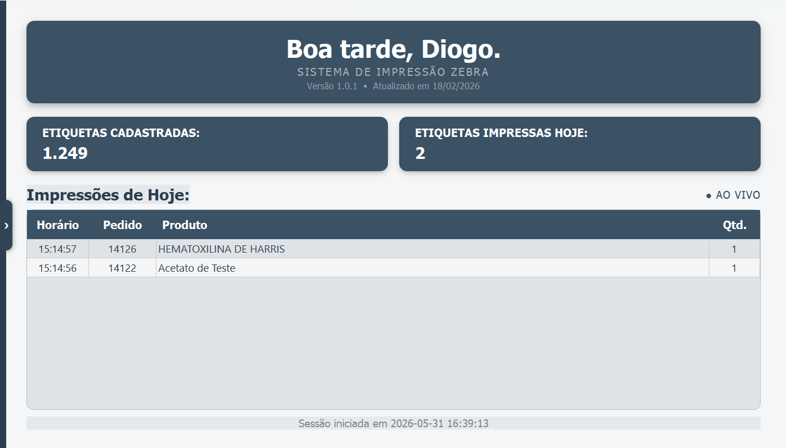
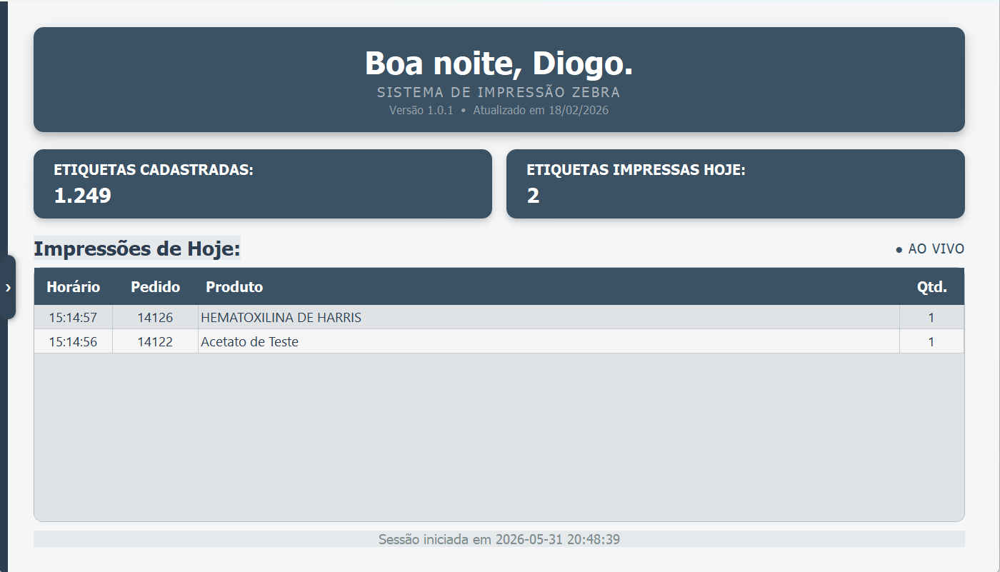
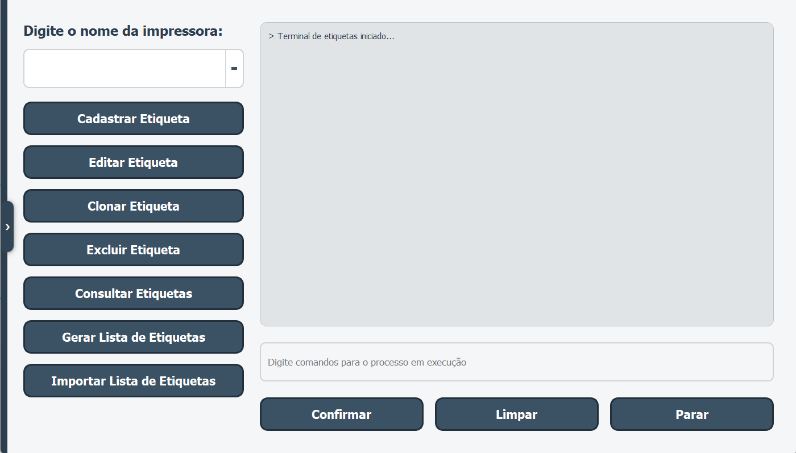
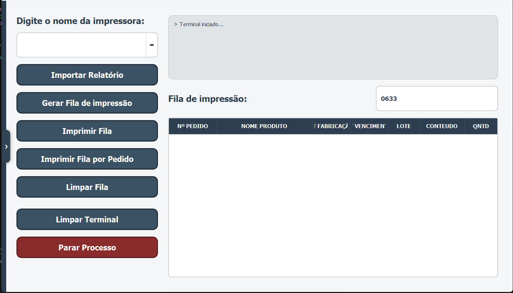
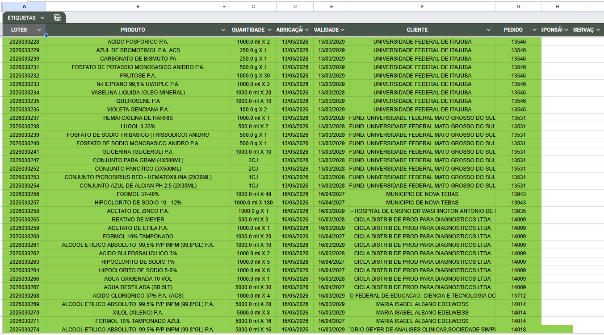

# Sistema de Etiquetas - Giesta

Sistema para geração, gerenciamento e impressão de etiquetas laboratoriais utilizando a impressora Zebra.

---

## Objetivo

Automatizar a geração e impressão de etiquetas laboratoriais, reduzindo erros manuais e padronização de informações críticas dos reagentes.

## Problemas do sistema e motivações

Antigamente o fluxo de impressão dentro da empresa era feito através de arquivos pré-produzidos de etiquetas dentro do editor de arquivos da Zebra, gerando um grande gargalo e reduzindo em muito o tempo de produção de cada item.
Existiam diversos problemas de formatação e padronização.

Levando em conta este cenário decidi criar um sistema de impressão de etiquetas que reduzisse os erros e aumentasse a velocidade de operação.

---

## Funcionalidades

- Cadastro de etiquetas
- Geração automática de etiquetas
- Controle de lotes
- Integração com planilha do Google Sheets
- Fila de impressão
- Histórico de registros

## Tecnologias

- Python
- PyQT5
- Google Sheets
- Zebra ZPL

---
 
## Desenvolvimento

Projeto desenvolvido integralmente por mim, incluindo análise de requisitos, arquitetura, desenvolvimento da interface, integrações externas, geração de etiquetas, gerenciamento de impressão e implantação.

---

## Principais telas e suas funcionalidades

### Menu de navegação

Menu que contem os botões que permitem o usuário alterar a tela atual. Também conta com o botão que permite colocar o sistema em tela cheia, ou sair.

### Início

Tela com as estatísticas básicas, tela que é vista quando abre o programa, nela é possível consultar o número de etiquetas cadastradas, o número total de etiquetas impressas. Bem como o histórico do dia de etiquetas impressas.

### Etiquetas Manutenção

Uma das 2 telas principais do sistema. Dentro dela que é feito o CRUD das etiquetas cadastradas. Nela o usuário consegue ADICIONAR, EDITAR, CLONAR, REMOVER ou VISUALIZAR. Também é permitido a importação de outras etiquetas vindas de outros sistemas, bem como a sua exportação. Além disso esta tela permite a impressão de etiquetas singulares.

### Etiquetas Relatório

A última tela do sistema. Nessa tela é onde o usuário vai passar a maior parte do tempo. Ela permite que o usuário importe um relatório específico gerado pelo sistema de pedidos (Já usado dentro da empresa) para gerar as etiquetas que devem ser imprimidas.

Por limitações deste sistema, e pelo fato de ser um sistema legado, não tem como fazer um chamado direto, nem receber as informações dos pedidos faturados. Portanto, uma das formas de contornar isso é importando diretamente um relatório gerado com as informações dos produtos que deverão ser impressos. Isso tudo sendo feito a partir do botão de importar relatório.

Ainda nessa tela é possível gerar uma fila de impressão. Mostrando item a item e separando-os por número de pedido. Com os botões de imprimir fila e imprimir fila por pedido é possível imprimir então as etiquetas diretamente na impressora Zebra. A diferenças é que no primeiro botão é impresso por produtos distintos e no segundo por pedido respectivamente.
Essas impressões vão diretamente para o google sheets via chamado da API do google, já gerando o histórico de cada etiqueta impressa, ideal para consultas posteriores.

### À parte do sistema

Como mencionado antes, todas as etiquetas impressas são enviadas diretamente para o Sheets, fazendo o controle de lote. No final do vídeo mostro uma etiqueta impressa como forma de ilustrar a formatação e como a impressão funciona dentro do sistema.

---

## Observação

Este repositório apresenta um estudo de caso do sistema. O código-fonte não é público por conter propriedade intelectual e informações relacionadas ao ambiente corporativo em que foi desenvolvido.
